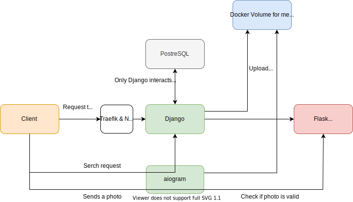

## This is [**astetique**](https://astetique.com/) - webservice for ...

- Blog post: **[1st part](https://barklan.github.io/2021/01/20/detectron2-train/)**, **[2nd part](https://barklan.github.io/2021/01/22/deploying-dl-models/)**. 

### Schema

### Backend (ansamble of Docker images with docker-compose):
 - **traefik** to make available through ssl with let's encrypt certs
 - **nginx** as a proxy-server
 - **gunicorn** as a production WSGI server
 - **Django** as the main app
 - **Flask** as the internal server to serve **PyTorch** models:
    - resnet8 as a binary clissifier (to filter dickpics)
    - Faster RCNN with resnet50 backbone as a detector (using [detectron2](https://github.com/facebookresearch/detectron2))
 - **aiogram** as a Telegram bot
 - **PostgreSQL** as database
 
### Frontend:
 - HTML/CSS with bootstrap 5
 - JS & JQuery (heavy use of AJAX requests)

Hosted on vultr.com with pure Ubuntu 18.04 and Docker

> Check out the [post](https://testdriven.io/dockerizing-django-with-postgres-gunicorn-and-nginx) which helped a lot

## Some dev notes below

#### A note on system managment

- `free -h`
- `df -h`

#### A note on docker volumes

- `docker system prune -a` to clear all used space by docker
- `docker volume ls` to list docker volumes
- `docker volume inspect volume_name` to inspect a volume
- `docker volume ls -f dangling=true` lets you identify dangling volumes

#### A note on symbolic links

- `ln -s /var/lib/docker/volumes/astetique_static_volume /home/docker/astetique`
- `ln -s /var/lib/docker/volumes/astetique_media_volume /home/docker/astetique`

#### Hard reset (don't do it)

- `docker-compose down -v`
- `./up.sh`
- `docker-compose -f docker-compose.yml exec web python manage.py makemigrations --noinput`
- `docker-compose -f docker-compose.yml exec web python manage.py migrate --noinput`

Then add from csv to database. Also, dont forget to pull staticfiles and upload mediafiles, postgres data.

#### Push to an existing repo

- `git remote add origin https://github.com/barklan/mipt.one-docker-static.git`
- `git branch -M main`
- `git push -u origin main`

